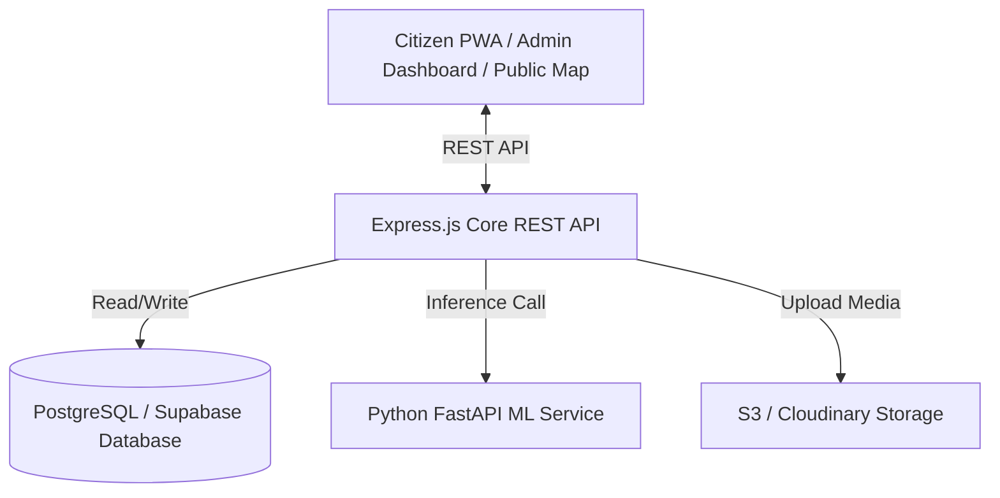
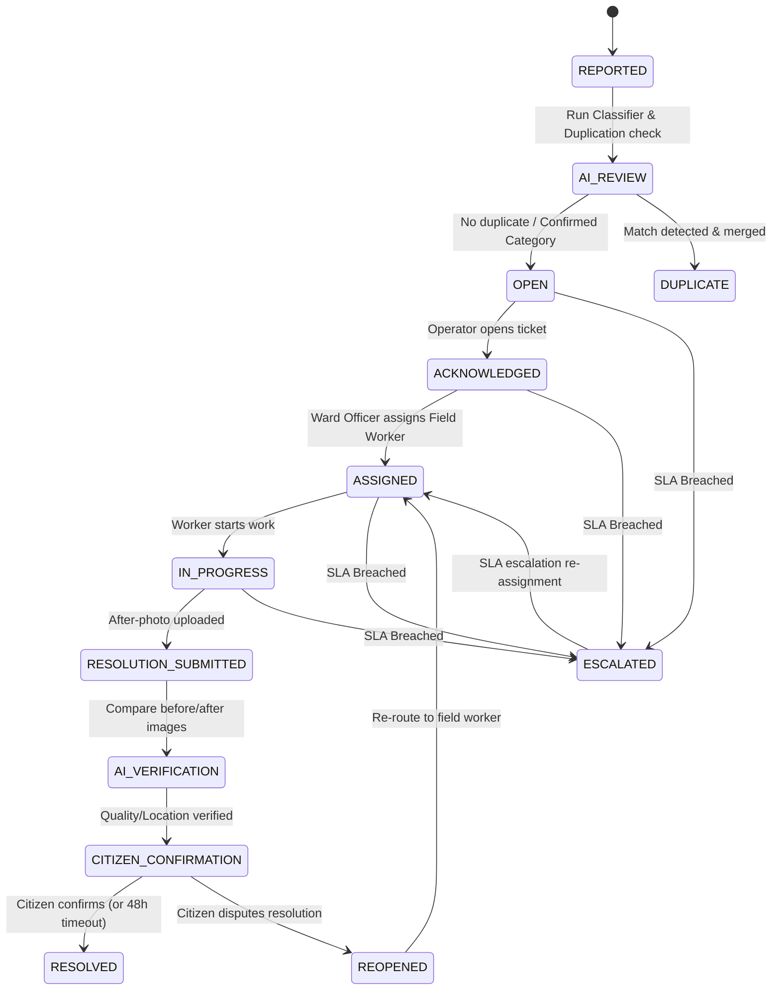

# Civique Implementation Master Specification

Civique is an AI-powered civic issue reporting, verification, and resolution platform designed to close the trust gap in civic grievance systems. It establishes a transparent, auditable, and automated loop from citizen reporting to verified resolution.

---

## 1. Product Vision & Core Principles

The central thesis of Civique: **Urban areas do not lack civic-complaint apps; they lack civic-complaint apps that citizens can trust.** 

Civique targets the specific, documented failure modes of existing systems:
1. **Fabricated Resolutions**: Resolved claims backed by false evidence.
2. **Silent SLA Breaches**: Tickets ignored indefinitely with no consequence.
3. **Illusion-of-Progress Alerts**: Stale automated status updates.
4. **Lack of Public Transparency**: Monolithic single-ticket systems without map visibility.
5. **Fragmented Scopes**: Separated platforms for sanitation, light, roads, etc.

### Core Principles
- **Proof-of-Resolution**: Every closed ticket must have physical evidence (after-photos, GPS matching, timestamps).
- **Citizen-First Privacy**: Minimal data collection, support for anonymous reporting, and strict alignment with the Digital Personal Data Protection (DPDP) Act.
- **Public Accountability**: Public live city-wide incident maps and performance leaderboards for municipal departments and wards.
- **Applied AI for Scale**: Machine learning-based auto-classification, geographic-semantic duplicate detection, automated priority calculation, and computer-vision-based resolution verification.

---

## 2. System Architecture

Civique is organized into three distinct tiers (simplified for PostgreSQL/Supabase):
1. **Client Layer**:
   - **Citizen Mobile-First PWA** (Next.js + Tailwind CSS)
   - **Admin Management Dashboard** (Next.js + Tailwind CSS)
   - **Public Live City Map** (Next.js + Leaflet / MapLibre GL)
2. **Core Backend Layer**:
   - **Express.js API (TypeScript)** handling authentication, database transactions, routing, SLA management, and auditing.
   - Fully integrated with **Supabase / PostgreSQL** database layer.
3. **Machine Learning Microservice**:
   - **FastAPI (Python)** running PyTorch-based model inferences (image classification, duplicate detection, and visual verification) isolated behind REST endpoints.



---

## 3. User Roles & Permissions

Civique implements strict Role-Based Access Control (RBAC) enforced on the backend:

| Role | Scope | Key Permissions |
| :--- | :--- | :--- |
| **CITIZEN** | Platform Public | Submit anonymous/authenticated reports, view live map, confirm/dispute resolutions. |
| **FIELD_WORKER** | Assigned Tasks | View assigned work orders, update work state to in-progress, upload after-photos. |
| **WARD_OFFICER** | Ward Boundaries | Assign work orders to field workers, update incident states, override priority locally. |
| **DEPARTMENT_HEAD** | Specific Department | Manage ward-level assignments, configure department routing, review SLA scorecards. |
| **ZONAL_OFFICER** | Zone (Multiple Wards) | View zone performance, receive Tier 1 SLA escalations, override assignments. |
| **COMMISSIONER** | City-wide | View city-wide scorecards, receive Tier 2 SLA escalations, manage city configurations. |
| **CITY_ADMIN** | City Boundary | Configure wards, departments, SLA policies, categories, and routing maps. |
| **SUPER_ADMIN** | Multi-City/Tenant | Platform-wide configuration, tenant isolation, global user management. |

---

## 4. Geographic Hierarchy & Spatial Engine

Civique stores locations using **PostGIS geometry data types** or coordinates (latitude, longitude) inside PostgreSQL and executes spatial queries using native Postgres SQL commands.

```
Country ➔ State ➔ City ➔ Zone ➔ Ward ➔ Department (Routes Categories within Ward)
```

- **Incident Location Point**: Coordinates (`latitude: Double`, `longitude: Double`) or PostGIS `GEOMETRY(Point, 4326)`.
- **Indexes Required**:
  - Spatial Index on location geography geometries.
  - Foreign key and query indexes on `city_id`, `ward_id`, `department_id`, `status`, `category`, and `created_at`.
- **Geofence Mapping**: Coordinates are checked against Ward boundary polygon geometries using standard Postgres spatial intersections (`ST_Contains`).

---

## 5. Incident Lifecycle State Machine

Status transitions are strictly guarded by state validation logic. Arbitrary status jumping is blocked.



---

## 6. Database Schema (PostgreSQL DDL)

### Users Table (`users`)
```sql
CREATE TYPE user_role AS ENUM ('CITIZEN', 'FIELD_WORKER', 'WARD_OFFICER', 'DEPARTMENT_HEAD', 'ZONAL_OFFICER', 'COMMISSIONER', 'CITY_ADMIN', 'SUPER_ADMIN');

CREATE TABLE users (
    id UUID PRIMARY KEY DEFAULT gen_random_uuid(),
    email VARCHAR(255) UNIQUE,
    phone_number VARCHAR(50) UNIQUE,
    password_hash VARCHAR(255),
    role user_role NOT NULL DEFAULT 'CITIZEN',
    city_id UUID,
    zone_id UUID,
    ward_id UUID,
    department_id UUID,
    active BOOLEAN NOT NULL DEFAULT true,
    notification_in_app BOOLEAN NOT NULL DEFAULT true,
    notification_email BOOLEAN NOT NULL DEFAULT true,
    notification_sms BOOLEAN NOT NULL DEFAULT true,
    created_at TIMESTAMP WITH TIME ZONE DEFAULT CURRENT_TIMESTAMP,
    updated_at TIMESTAMP WITH TIME ZONE DEFAULT CURRENT_TIMESTAMP
);
```

### Reports Table (`reports`)
```sql
CREATE TABLE reports (
    id UUID PRIMARY KEY DEFAULT gen_random_uuid(),
    incident_id UUID REFERENCES incidents(id) ON DELETE SET NULL,
    submitter_ref UUID REFERENCES users(id) ON DELETE SET NULL,
    anonymous_token VARCHAR(255),
    photo_url VARCHAR(500) NOT NULL,
    description TEXT,
    voice_transcript TEXT,
    category_suggested VARCHAR(100),
    category_confirmed VARCHAR(100),
    category_confidence NUMERIC(5, 2),
    latitude DOUBLE PRECISION NOT NULL,
    longitude DOUBLE PRECISION NOT NULL,
    capture_method VARCHAR(50) DEFAULT 'CAMERA_LIVE',
    device_timestamp TIMESTAMP WITH TIME ZONE,
    gps_timestamp TIMESTAMP WITH TIME ZONE,
    image_hash VARCHAR(255),
    created_at TIMESTAMP WITH TIME ZONE DEFAULT CURRENT_TIMESTAMP
);
```

### Incidents Table (`incidents`)
```sql
CREATE TYPE incident_status AS ENUM ('REPORTED', 'AI_REVIEW', 'OPEN', 'ACKNOWLEDGED', 'ASSIGNED', 'IN_PROGRESS', 'RESOLUTION_SUBMITTED', 'AI_VERIFICATION', 'CITIZEN_CONFIRMATION', 'RESOLVED', 'DUPLICATE', 'REJECTED', 'ESCALATED', 'DISPUTED', 'REOPENED');
CREATE TYPE priority_level AS ENUM ('LOW', 'MEDIUM', 'HIGH', 'CRITICAL');

CREATE TABLE incidents (
    id UUID PRIMARY KEY DEFAULT gen_random_uuid(),
    public_tracking_id VARCHAR(50) UNIQUE NOT NULL,
    category VARCHAR(100) NOT NULL,
    status incident_status NOT NULL DEFAULT 'REPORTED',
    priority priority_level NOT NULL DEFAULT 'MEDIUM',
    priority_score INTEGER DEFAULT 0,
    latitude DOUBLE PRECISION NOT NULL,
    longitude DOUBLE PRECISION NOT NULL,
    city_id UUID,
    zone_id UUID,
    ward_id UUID,
    department_id UUID,
    report_count INTEGER DEFAULT 1,
    before_photo_urls TEXT[],
    after_photo_urls TEXT[],
    worker_ref UUID REFERENCES users(id),
    resolved_notes TEXT,
    sla_deadline TIMESTAMP WITH TIME ZONE,
    sla_breached BOOLEAN DEFAULT false,
    assigned_to UUID REFERENCES users(id),
    assigned_by UUID REFERENCES users(id),
    assigned_at TIMESTAMP WITH TIME ZONE,
    started_at TIMESTAMP WITH TIME ZONE,
    completed_at TIMESTAMP WITH TIME ZONE,
    created_at TIMESTAMP WITH TIME ZONE DEFAULT CURRENT_TIMESTAMP,
    resolved_at TIMESTAMP WITH TIME ZONE
);
```

### Departments Table (`departments`)
```sql
CREATE TABLE departments (
    id UUID PRIMARY KEY DEFAULT gen_random_uuid(),
    name VARCHAR(255) NOT NULL,
    city_id UUID,
    handled_categories VARCHAR(100)[],
    default_sla_hours INTEGER DEFAULT 24,
    warning_threshold_hours INTEGER DEFAULT 4,
    created_at TIMESTAMP WITH TIME ZONE DEFAULT CURRENT_TIMESTAMP
);
```

### Audit Logs Table (`audit_logs`)
```sql
CREATE TABLE audit_logs (
    id UUID PRIMARY KEY DEFAULT gen_random_uuid(),
    incident_id UUID REFERENCES incidents(id) ON DELETE CASCADE,
    event_type VARCHAR(100) NOT NULL,
    actor VARCHAR(255) NOT NULL, -- User UUID or 'SYSTEM'
    previous_hash VARCHAR(64),
    current_hash VARCHAR(64) NOT NULL,
    metadata JSONB,
    timestamp TIMESTAMP WITH TIME ZONE DEFAULT CURRENT_TIMESTAMP
);
```

---

## 7. API Contract (`/api/v1`)

All error responses follow the standard format:
`{ "success": false, "error": { "code": String, "message": String, "details": [] } }`

### Auth Group
- `POST /auth/login`
  - Body: `{ email, password }`
  - Returns: `{ accessToken, refreshToken, user: { role, name } }`
- `POST /auth/refresh`
  - Body: `{ refreshToken }`
  - Returns: `{ accessToken, refreshToken }`
- `POST /auth/logout`
  - Body: `{ refreshToken }`

### Reports Group
- `POST /reports` (Anonymous-friendly)
  - Body (Multipart): `{ file (image), latitude, longitude, categorySuggested, description }`
  - Returns: `{ success: true, trackingId, duplicateIncidentId: null }`

### Incidents Group
- `GET /incidents?bbox=minLng,minLat,maxLng,maxLat&status=OPEN&category=POTHOLE`
  - Returns: `{ success: true, incidents: [...] }`
- `GET /incidents/:id`
  - Returns: `{ success: true, incident: {...} }`
- `PATCH /incidents/:id/status` (Role: WARD_OFFICER+)
  - Body: `{ status }`
- `POST /incidents/:id/assign` (Role: WARD_OFFICER+)
  - Body: `{ fieldWorkerId }`
- `POST /incidents/:id/resolve` (Role: FIELD_WORKER)
  - Body (Multipart): `{ file (after-image), notes, latitude, longitude }`

### Verification Group
- `POST /incidents/:id/confirm-resolution` (Citizen-only)
  - Body: `{ action: "CONFIRM" | "DISPUTE", notes: String }`

---

## 8. AI Services & ML Pipeline

The FastAPI microservice implements five models:
1. **Category Classification**: MobileNetV2 fine-tuned model classifying reports into categories (e.g., Pothole vs Garbage).
2. **Image Embeddings (Duplicate Detection)**: Computes 1024-dimensional feature vectors. Complemented by coordinates distance checking, checking if reports share visual layout.
3. **Priority & Urgency Scoring**: TF-IDF classification of description texts, combined with report density and category risk metrics.
4. **Resolution Verification**: Pairs before/after images, runs structural similarity (SSIM) checks, and scans for object omission (e.g., garbage objects removed).
5. **Predictive Hotspot Analytics**: Run-time model using **Prophet** on historical grid-based incident occurrences to identify high-risk wards for future periods.

---

## 9. Testing & Verification Plan

### Unit Testing
- Test SLA breach duration math and timezone boundaries.
- Test state-transition logic against illegal paths.
- Test permission matrix for all 8 roles.
- Test hashing chains for the append-only audit trail.

### Integration Testing
- Test Multipart uploads for reports.
- Test PostgreSQL proximity and bounding-box queries.
- Test Express REST client connection to FastAPI endpoints.

### E2E Testing (Playwright "Golden Flow")
- **Step 1**: Citizen submits a new pothole report with coordinates.
- **Step 2**: System routes the report, matches no duplicates, and creates an Incident.
- **Step 3**: Incident appears on the Live Map.
- **Step 4**: Admin assigns ticket to Field Worker.
- **Step 5**: Field Worker submits resolution with an after-photo.
- **Step 6**: AI verification reports success score.
- **Step 7**: Citizen rejects/confirms resolution, ticket moves to `RESOLVED` status, and audit hashes are verified.

---

## 10. Implementation Roadmap & Acceptance Criteria

### Phase 1: Foundation (Modules M0 - M3)
- **M0: Product Foundation**: Establish `Implementation.md` (This document).
- **M1: Project Foundation**: Setup npm workspaces, initialize Express (TypeScript), Next.js (TypeScript/Tailwind/Shadcn), Python (FastAPI), local PostgreSQL container.
  - *Acceptance*: Services communicate, and health check endpoints respond with `200 OK`.
- **M2: Auth & Guarding**: RBAC logic, access/refresh token rotation.
  - *Acceptance*: Restricted endpoints reject invalid tokens; public endpoints allow anonymous inputs.
- **M3: Spatial Geography**: City, Zone, Ward polygon modeling, geofence coordinate assignment.
  - *Acceptance*: A coordinates pair matches a specific ward; viewport bounding-box lookup works.

### Phase 2: Citizen Reporting (Modules M4 - M5)
- **M4: Citizen Reporting**: Mobile-first report UI with Camera/GPS acquisition.
  - *Acceptance*: Citizen can capture photo, acquire coordinates, and receive a public tracking ID.
- **M5: Report-to-Incident Engine**: Decouple raw Reports from Incidents; draft duplicate detection abstraction.
  - *Acceptance*: First report creates Incident; subsequent nearby reports link to the same Incident.

### Phase 3: Public Map & Real-time (Modules M6 - M7)
- **M6: Live Map**: Interactive viewport render with category/status filters.
  - *Acceptance*: Map renders incidents, groups coordinates, and dynamically loads map views.
- **M7: Real-time Sync**: Socket.io gateway integration.
  - *Acceptance*: Map overlays and admin queues update live when incidents are edited.

### Phase 4: Municipal Operations (Modules M8 - M10)
- **M8: Admin Console**: Role-scoped dashboard queues for officials.
  - *Acceptance*: Officials see lists filtered by their assigned ward/department.
- **M9: Department Routing**: Category-to-Department mapping tables.
  - *Acceptance*: Incidents are routed to correct departments; ward officers can assign tasks.
- **M10: Worker Taskboard**: Work order forms and resolution upload interface.
  - *Acceptance*: Field workers mark tasks started and submit after-photo resolutions.

### Phase 5: Accountability & Alerts (Modules M11 - M12, M17)
- **M11: SLA escalation Engine**: Cron daemon scans and escalations.
  - *Acceptance*: Expired SLA deadline updates level, assigns new officer, and marks incident public.
- **M12: Notifications System**: Central notifications router.
  - *Acceptance*: Multi-channel dispatching updates in-app notification center.
- **M17: Audit Trail**: Cryptographic change tracker.
  - *Acceptance*: Any state change computes SHA256; verification validates integrity of history.

### Phase 6: AI Analytics (Modules M13 - M16)
- **M13: Category Auto-Classification**: MobileNetV2 FastAPI.
  - *Acceptance*: Post requests return suggested label with confidence score.
- **M14: Duplication Pipeline**: Cosine similarity embedding analysis.
  - *Acceptance*: Nearby visual duplicate tickets are clustered automatically.
- **M15: Priority Classifier**: NLP priority score estimator.
  - *Acceptance*: Combined risk weight returns 0-100 priority score.
- **M16: Visual Verification**: Before/after image comparison checks.
  - *Acceptance*: Image comparisons output structural changes and quality metrics.

### Phase 7: Civic Intelligence (Modules M18 - M21)
- **M18: Public Analytics Scorecards**: Performance comparisons.
  - *Acceptance*: Wards are ranked by average resolution speed.
- **M19: Civic Health Score**: Unified health scores computed nightly.
  - *Acceptance*: Heatmap displays health indexes.
- **M20: Civic Asset Registry**: Municipal infrastructure linking.
  - *Acceptance*: Incidents associate with municipal assets.
- **M21: Predictive Hotspots**: Prophet forecast maps.
  - *Acceptance*: Predictions are rendered on prediction maps.
