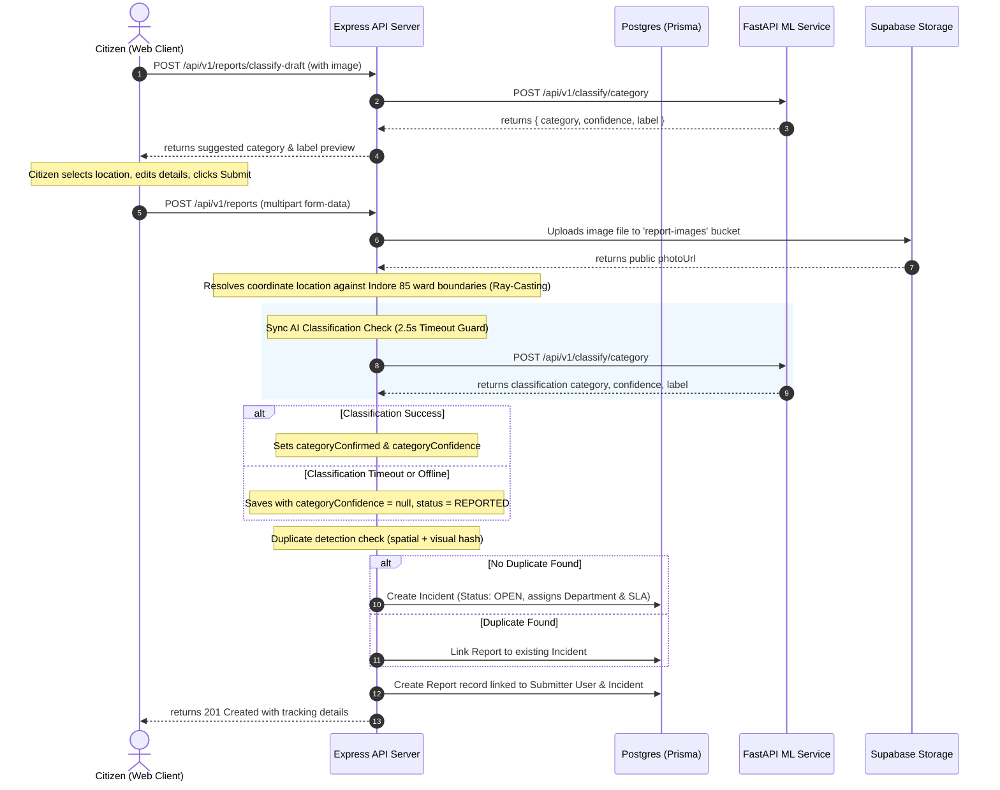

# Civique: Current Report Architecture Audit (Module 0)

> **Historical snapshot.** This file describes the pre-correction report/AI flow and is not the active implementation plan. The current direction is defined in [`docs/IMPLEMENTATION_PLAN.md`](../IMPLEMENTATION_PLAN.md): correct M0–M13 first and replace the planned Gemini path with Groq `qwen/qwen3.8-27b` during M13. The running prototype currently uses ConvNeXt-Tiny/ImageNet mapping with text heuristics, not MobileNetV2.

This document maps the existing report submission, geolocation, image storage, classification, and routing architecture in **Civique** prior to implementing the new AI-powered verification features.

---

## 1. System Overview & Monorepo Layout

Civique is structured as a monorepo containing three core components:
1. **Next.js Web Client** (`apps/web`): Citizen portal for reporting issues, public live maps, and administrators' control dashboard. Runs on port `3000`.
2. **Express.js API Server** (`services/api`): Heart of business logic, database transactions, geofencing, routing, and real-time Socket.io communication. Runs on port `5000`.
3. **FastAPI ML Service** (`services/ml`): Image classification microservice. Runs on port `8000`.

---

## 2. Report Submission Data Flow

---

## 3. Database Schema Mapping (Prisma)

The core relational models involved in report submission are:

### Submitter / Users (`User` Model)
* Represents citizens, department officers, and administrators.
* Links to reports via `reports Report[] @relation("Submitter")`.

### Reports (`Report` Model)
* Represents individual submissions from citizens (with images).
* Fields of interest:
  * `id`: UUID (Primary Key)
  * `photoUrl`: String (Supabase Storage URL)
  * `description`: String (Citizen explanation)
  * `categorySuggested`: String (AI classification output)
  * `categoryConfirmed`: String (Category user submitted/confirmed)
  * `categoryConfidence`: Decimal (AI prediction confidence score)
  * `latitude` / `longitude`: Double (GPS coordinates)
  * `imageHash`: String (Visual fingerprint hash)
  * `citizenName` / `citizenPhone`: Optional contact info
  * `landmark`: Landmark reference
  * `severity`: Grievance severity rating
  * `incidentId`: Relation reference back to actionable `Incident`

### Incidents (`Incident` Model)
* Represents the verified, actionable problem on the ground.
* Links multiple duplicate reports to one single incident:
  * `status`: Status enum (`REPORTED`, `OPEN`, `ASSIGNED`, `IN_PROGRESS`, etc.)
  * `category`: Final category string
  * `departmentId`: Routed municipal department
  * `slaDeadline`: Date time computed based on category routing guidelines

---

## 4. Key API Endpoints (Express & FastAPI)

### Express.js API Gateway (Port `5000`)
* **`POST /api/v1/reports`**: Parses multipart file uploads (Multer), sends file to Supabase storage, checks Indore ward boundaries, performs ML checks, runs duplicate analysis, creates records in Prisma, and broadcasts real-time Socket.io events.
* **`POST /api/v1/reports/classify-draft`**: Proxy endpoint to FastAPI ML classifier. Used on-the-fly when a citizen selects an image to dynamically suggest a category card.
* **`GET /api/v1/reports`**: Fetches submissions (scoped by role: citizens view their own, officials view all).

### FastAPI ML Service (Port `8000`)
* **`POST /api/v1/classify/category`**: Accepts an uploaded image file and optional description. Evaluates using pre-trained `MobileNetV2` (or falls back to zero-dependency keyword matching if PyTorch is offline) and returns the predicted category, score, and raw class label.

---

## 5. Existing Core Integrations & Dependencies

* **Prisma ORM**: Object-relational mapping to PostgreSQL.
* **Leaflet / OpenStreetMap**: Renders geospatial interactive maps on frontend and handles marker offsets.
* **Supabase Client**: Storage solution for saving citizen photographs.
* **Multer**: Node middleware for parsing `multipart/form-data` uploads.
* **MobileNetV2**: PyTorch convolutional network trained on 1,000 ImageNet categories, mapped to Indore's municipal classifications.
